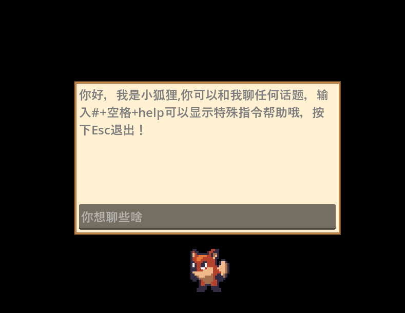

# 桌面宠物项目文档

## 项目简介
这是一个使用Godot引擎4.3开发的桌面宠物应用。项目实现了一个可爱的桌面宠物，它可以与用户互动，支持大模型对话，并具有多种有趣的动画效果。

## 主要功能

### 1. 基础功能
- 透明窗口显示
- 置顶显示
- 窗口拖拽
- 动画系统

### 2. 交互功能
- 鼠标左键点击呼出聊天栏
- 鼠标右键按住可拖动宠物
- 支持与大模型AI对话
- 特殊指令系统（输入 #help 获取帮助）

### 3. 特色功能
- 放烟花效果
- 冥想休息模式
- 跟随鼠标移动

## 项目结构

### 场景文件 (scenes/)
- `pet.tscn` - 主场景，包含宠物的基本设置和行为
- `llmapi.tscn` - AI对话接口场景
- `fire_work.tscn` - 烟花效果场景
- `home.tscn` - 休息场景
- `rocket.tscn` - 火箭效果场景
- `clock.tscn` - 时钟场景

### 脚本文件 (scenes/)
- `pet.gd` - 宠物核心逻辑
- `llmapi.gd` - AI接口实现
- `fire_work.gd` - 烟花效果实现
- `home_window.gd` - 休息窗口管理
- `rocket.gd` - 火箭效果实现

### 资源文件 (assets/)
- 角色贴图
- 音效文件
- 场景贴图
- 特效贴图

## 使用说明

### 环境要求
- Godot引擎 4.3版本
- 通义千问API密钥（可选）或Ollama本地模型

### 运行方式
1. 使用Godot引擎打开项目
2. 配置AI接口（如使用通义千问API需要在llmapi.gd中配置密钥）
3. 运行项目

### 操作说明
- 左键点击：打开聊天窗口
- 右键按住：拖动宠物
- ESC键：退出程序
- 输入#help：查看特殊指令

## 开发计划
- [ ] 添加番茄钟功能
- [ ] 开发休闲小游戏
- [ ] 优化动画系统
- [ ] 增加更多互动方式

## 界面预览

## 许可证
请参考项目根目录下的LICENSE文件。